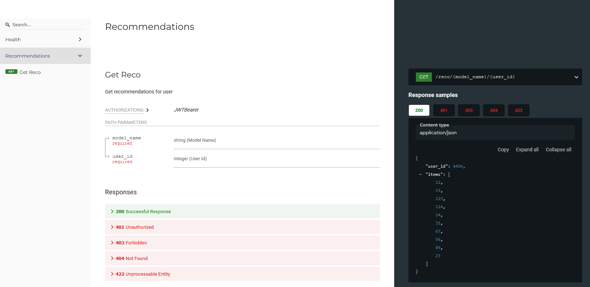

# Cервис рекомендаций "RecoService API"

[](https://github.com/iloncka-ds/RecoService/actions/workflows/cicd.yml)

## Установка и настройка среды окружения

### Python

Используется Python3.8

### Make

[Make](https://www.gnu.org/software/make/) - это очень популярная утилита, 
предназначенная для преобразования одних файлов в другие через определенную последовательность команд. 
Однако ее можно использовать для исполнения произвольных последовательностей команд. 
Команды и правила их исполнения прописываются в `Makefile`.

### Poetry

[Poetry](https://python-poetry.org/) - это удобный инструмент для работы с зависимостями в Python. 
Мы будем использовать его для подготовки окружения.

Поэтому перед началом работы необходимо выполнить [шаги по установке](https://python-poetry.org/docs/#installation).


## Виртуальное окружение

Мы будем работать в виртуальном окружении, которое создадим специально для данного проекта. 
Если вы не знакомы с концепцией виртуальных окружений в Python, обязательно 
[познакомьтесь](https://docs.python.org/3.8/tutorial/venv.html). 

### Инициализация окружения

Выполните команду
```
make setup
```

Будет создано новое виртуальное окружение в папке `.venv`.
В него будут установлены пакеты, перечисленные в файле `pyproject.toml`.

Обратите внимание: если вы один раз выполнили `make setup`, при попытке повторного ее выполнения ничего не произойдет, 
поскольку единственная ее зависимость - директория `.venv` - уже существует.
Если вам по какой-то причине нужно пересобрать окружение с нуля, 
выполните сначала команду `make clean` - она удалит старое окружение.

### Установка/удаление пакетов

Для установки новых пакетов используйте команду `poetry add`, для удаления - `poetry remove`. 

## Линтеры, тесты и автоформатирование

### Автоматическая проверка кода перед коммитами

Для автоматической проверки кода установлен пакет pre-commit c хуками. Для первого запуска после установки нужно запустить `pre-commit install` и  `pre-commit run -a`, затем все проверки будут проходить автоматически при каждом коммите.


### Автоформатирование

Командой `make format` можно запустить автоматическое форматирование кода.

### Статическая проверка кода

Командой `make lint` вы запустите проверку линтерами - инструментами для статического анализа кода. 
Они помогают выявить ошибки в коде еще до его запуска, а также обнаруживают несоответствия стандарту 
[PEP8](https://peps.python.org/pep-0008).

### Тесты

Командой `make test` вы запустите тесты при помощи утилиты [pytest](https://pytest.org/). 


## Запуск сервиса

### Способ 1: Python + Uvicorn

```
python main.py
```

Приложение запустится локально, в одном процессе. 
Хост и порт по умолчанию: `127.0.0.1` и `8080`.
Их можно изменить через переменные окружения `HOST` и `PORT`.

Управляет процессом легковесный [ASGI](https://asgi.readthedocs.io/en/latest/) server [uvicorn](https://www.uvicorn.org/).

Обратите внимание: для запуска нужно использовать `python` из окружения проекта.

### Способ 2: Uvicorn

```
uvicorn main:app
```

Очень похож на предыдущий, только запуск идет напрямую.
Хост и порт можно передать через аргументы командной строки.

Обратите внимание: для запуска нужно использовать `uvicorn` из окружения проекта.


### Способ 3: Gunicorn

```
gunicorn main:app -c gunicorn.config.py
```

Способ похож на предыдущий, только вместо `uvicorn` используется
более функциональный сервер [gunicorn](https://gunicorn.org/) (`uvicorn` используется внутри него).
Параметры задаются через конфиг, хост и порт можно задать 
через переменные окружения или аргументы командной строки.

Сервис запускается в несколько параллельных процессов, по умолчанию их число
равно числу ядер процессора.

Обратите внимание: для запуска нужно использовать `gunicorn` из окружения проекта.

### Способ 4: Docker

Делаем все то же самое, но внутри [docker](https://www.docker.com/)-контейнера. 

Внутри контейнера можно использовать любой из способов, описанных выше.
В продакшене рекомендуется использовать `gunicorn`.

Собрать и запустить образ можно командой

```
make run
```
## Документация API

Чтобы ознакомиться с документацией сервиса после его запуска нужно выполнить команду  

```
http://localhost:8080/redoc
```


В настоящее время сервис поддерживает две конечные точки:  
- `/health`


- `/reco/{model_name}/{user_id}`


